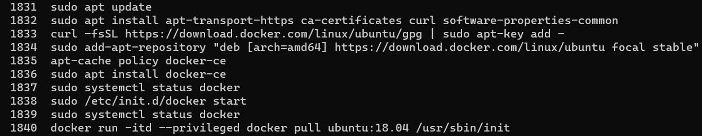
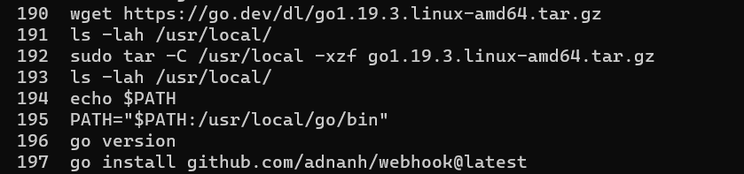

## Part 1 - Dockerize it

### Documentation

- Run Project Locally
  - how you installed docker + dependencies (WSL2, for example)
	- I first intstalled Docker Desktop and created an account. Next, on WSL2, I updated the system. Afterwards, I used digitial ocean as reference website and manually downloaded docker onto my WSL2. 
	- 
  - how to build the container from the Dockerfile
	- After your Dockerfile has been configured correctly, you can simply set it up using the command `docker build -t website .` 
  - how to run the container
  	- `docker run --name Project5Website -d -p 8080:80` 
  - how to view the project running in the container (open a browser...go to ip and port...)
	- You first must open a browser of your choice. From there you can either enter `localhost` or your public IP. Either will be followed the port you binded the project to `localhost:8080`

### Resources

- [Docker Install - Docker Docs](https://www.digitalocean.com/community/tutorials/how-to-install-and-use-docker-on-ubuntu-22-04)

## Part 2 - GitHub Actions and DockerHub

### Documentation

- Process to create public repo in DockerHub
	- Login to DockerHub. Next, click on the Repositories tab. Click on `Create repository`. Enter a name, a description, public, and then click create.
- How to authenticate with DockerHub via CLI using Dockerhub credentials
	- To authenticate, an access token will be used. Go to your Account Settings and click on Security. Click New Access Token, enter a Access Token Description, choose Access permission, and last click Generate. On WSL2, enter `docker login -u maxfaxsurgeon`. At the password prompt, enter the personal access token. 
  - what credentials would you recommend providing?
	- I recommend providing an access token over a password
- How to push container to Dockerhub
	- `docker push maxfaxsurgeon/catgif:2.0`

---

- Configuring GitHub Secrets
  - What secrets were set based on what info
	- Username: `DOCKER_USERNAME`, Token `DOCKER_TOKEN`
- Behavior of GitHub workflow
  - what does it do and when
	- A workflow is a configurable automated process that will run one or more jobs. Workflows are defined by a YAML file checked in to your repository and will run when triggered by an event in your repository, or they can be triggered manually, or at a defined schedule.
  - what variables in workflow are custom to your project
	- My username, password, and my repository name.
  - think may need to be changed if someone else is going to use it or you reuse it
	- Username secret & password secret configuration

### Resources

- [GitHub Actions - Docker Docs](https://docs.docker.com/ci-cd/github-actions/)

## Part 3 - Deployment

### Documentation

- Description of container restart script
	- Stop the container that is currently running
	- Remove the container
	- Pull the latest image of the container from DockerHub
	- Run the latest container
	
- Description of Webhook task definition file
	- id = hook name
	- execute-command = detects which file to execute
	- command-working-directory = where the webhook will be running
	
--- 

- Setting up a webhook on the server
  - How you created you own listener
	- `/home/ubuntu/go/bin/webhook -hooks /home/ubuntu/redeploy.json -verbose`
  - How you installed/running the [webhook on GitHub](https://github.com/adnanh/webhook)
	- 
	- Using `sudo lsof | grep LISTEN` and `curl 3.218.172.180:9000/hooks/khan` to test the webhook.
- Steps to set up a notifier in GitHub or DockerHub
	- Login to DockerHub. Next, click on the Repositories tab. Click on your repository of choice. Click on the Webhooks tab. Under New Webhook enter a vaild Webhook name and URL (`http://3.218.172.180:8080/`) and then click create. 
